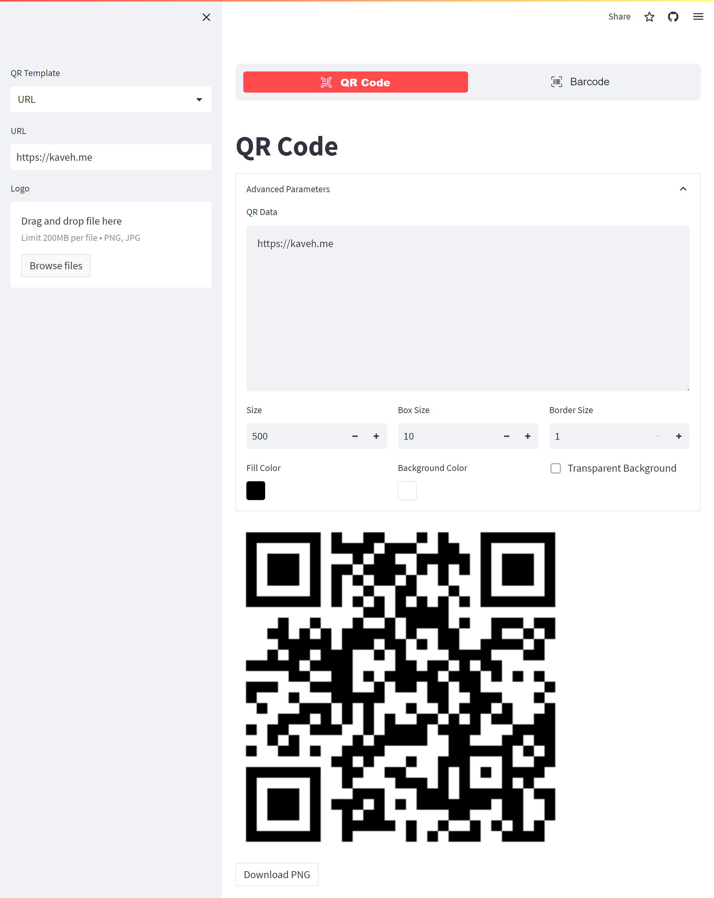

# QR Code and Barcode Generator
This is an Streamlit app to generate QR codes and Barcodes with different formats.

___
## Run
In order to run this app, you need to install the dependencies first based on
the `_environment.yml` file.

```bash
conda env create -f _environment.yml
```

Once the dependencies are installed, run the dashboard using `streamlit`.

```bash
streamlit run ./main.py
```

### Run on Docker
This application is available on [Docker Hub](https://hub.docker.com/r/kavehbc/qrcode-barcode), and it can be run directly using:

```bash
docker run -p 80:8501 kavehbc/qrcode-barcode
```

Once you run it, you can open it in your browser on [http://127.0.0.1](http://127.0.0.1).

> **Apple M1 Silicon - Arm64**
> 
> As of today (`Dec 2021`), this Docker Image is not compatible with `Apple M1 Silicon`.
> Instead, the source code can be run using `conda` on `Rosetta 2`.

### Live demo
You can check its live demo here:
[https://qrcode-barcode.streamlit.app/](https://qrcode-barcode.streamlit.app/)

## Screenshot


___

## GitHub Repo
This project is open-source, and it is available on GitHub at [https://github.com/kavehbc/qr-barcode-generator](https://github.com/kavehbc/qr-barcode-generator).

## Developer(s)
Kaveh Bakhtiyari - [Website](http://bakhtiyari.com) | [Medium](https://medium.com/@bakhtiyari)
  | [LinkedIn](https://www.linkedin.com/in/bakhtiyari) | [GitHub](https://github.com/kavehbc)

## Contribution
Feel free to join the open-source community and contribute to this repository.
